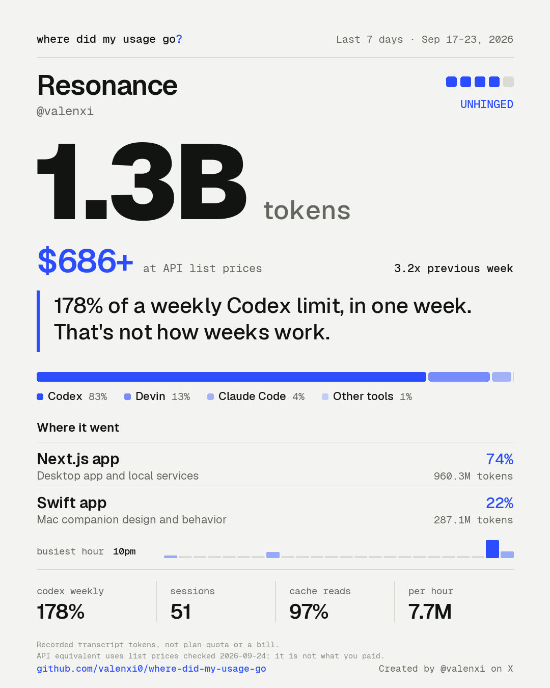
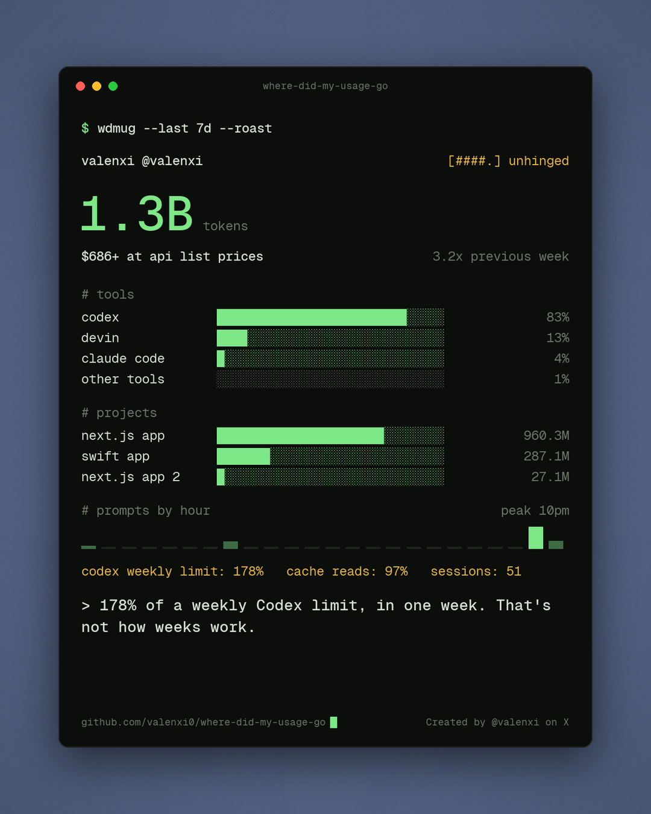
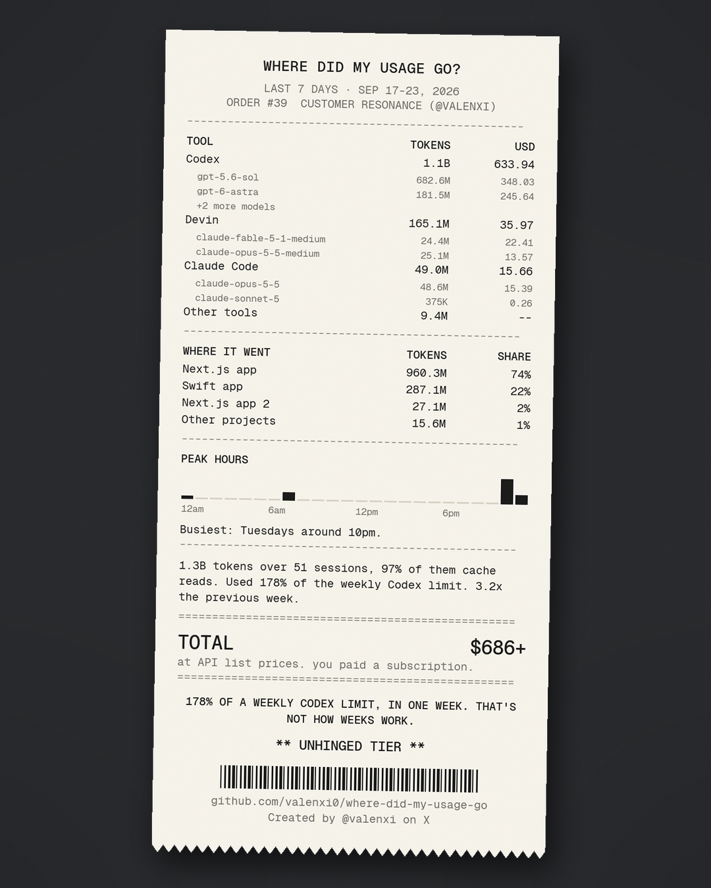
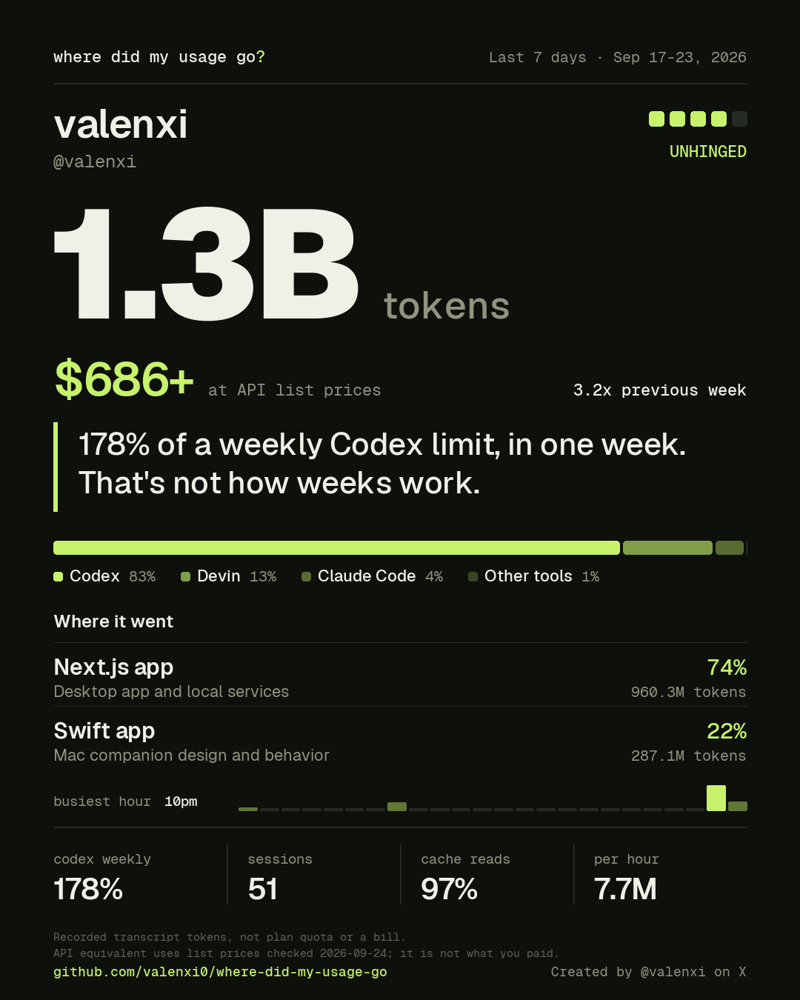
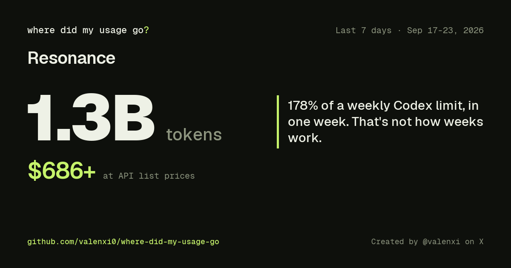

# Where Did My Usage Go

[](https://github.com/valenxi0/Where-Did-My-Usage-Go/actions/workflows/test.yml)

POV: It's Wednesday, you're out of usage and there are no resets coming to save you. You wonder where all of your usage went? This skill tells you how.

It reads the history that Claude Code, Codex, Devin, and other coding agents already save on your machine, and turns your week into a card you can post. The card shows how many tokens you used, what they would cost at API list prices, which tools and projects used them, how much of your plan limit went, and a roast.

It's a joke with real numbers. Token counts come from your agents' own logs, and prices come from each provider's pricing page. It is not a bill.

## A real week

This is [@valenxi](https://x.com/valenxi)'s week of Sep 17-23, 2026, in the three card styles:

<p>



</p>

| Style | What it shows |
|---|---|
| Classic | The token total, the price, the roast, and a row of stats. It has four color themes: `paper`, `night`, `ember`, and `cobalt`. |
| Terminal | The same week as command-line output with bar charts, in a window on a slate background. |
| Receipt | An itemized bill with each tool and its most expensive models, the top projects, your busiest hours, and the total. |

 

Each style also exports as an Instagram Story (1080×1920) and a link preview (1200×630).

## Install

With [`npx skills`](https://www.npmjs.com/package/skills), which installs into Claude Code, Codex, and other agents:

```bash
npx skills add valenxi0/Where-Did-My-Usage-Go -g
```

As a Claude Code plugin:

```
/plugin marketplace add valenxi0/Where-Did-My-Usage-Go
/plugin install where-did-my-usage-go@where-did-my-usage-go
```

By hand, copy or symlink [`skills/where-did-my-usage-go`](skills/where-did-my-usage-go) into `~/.claude/skills` or `~/.codex/skills`.

Making the PNG needs Python 3.11 or later and Pillow. If Pillow is missing, the skill runs the export with `uv run --with pillow`.

## Run it

| Agent | Command |
|---|---|
| Claude Code | `/where-did-my-usage-go` |
| Claude Code, installed as a plugin | `/where-did-my-usage-go:where-did-my-usage-go` |
| Codex | `$where-did-my-usage-go` |

You can add a window, as in `/where-did-my-usage-go last 7 days`, or ask in plain words: "where did my usage go this week?"

The skill asks three questions, all on one screen:

1. Which window: last 7 days, 24 hours, 30 days, or a custom range.
2. Which card style: classic, terminal, receipt, or all three to compare.
3. Who's on the card: your name and @handle, your name with project names hidden, or anonymous.

The card appears about 10 seconds after you answer, with an automatic roast. Then the skill offers an upgrade: it checks what you actually built, writes three custom roasts for you to pick from, and redraws the card. That takes about two more minutes. It also offers a different theme, a Story or link-preview version, or a comparison with your plan's price, and re-exporting is free.

The skill remembers your answers, so the next time it asks only for the window.

### Use a cheap model

A skill that measures your usage shouldn't eat much of it. The first card costs almost nothing, and the upgrade mostly reads logs and fills in a template, which a small, fast model does well. Before you run it, switch to one: `/model haiku` in Claude Code, or a small model in Codex. A bigger model writes slightly sharper roasts, and that's the only difference.

To make a card without an agent, which uses no tokens:

```bash
cd skills/where-did-my-usage-go
uv run --with pillow python scripts/quick.py --days 7 --name 'Your Name' --style receipt
```

## How it works

```
collect.py  ->  draft.py  ->  agent checks the work and writes roasts  ->  export_card.py
```

1. **It checks for the agents it knows.** `collect.py` looks up each known agent's command (`codex`, `claude`, `devin`, and so on) and its history folder, and reads nothing else. It never lists the rest of your `PATH` or runs any command. If you use an agent it doesn't know, name it with `--agent-cli COMMAND`.
2. **It reads their history without changing it.**

   | Agent | History location |
   |---|---|
   | Codex | `~/.codex/sessions`, which also has tokens, models, and plan-limit snapshots |
   | Claude Code | `~/.claude/projects`, including subagent transcripts |
   | Devin CLI | `~/.local/share/devin/cli/sessions.db` |
   | OpenCode | `~/.local/share/opencode/opencode.db` |
   | Factory Droid | `~/.factory/sessions`, which records activity but not tokens |
   | Kimi Code | `~/.kimi-code/sessions` |
   | Grok | `~/.grok/sessions` |

   Cursor keeps no token counts on your machine, so the skill can count its activity but not its tokens.
3. **It adds up the numbers.** It totals tokens by tool, project, and model. It counts prompt habits and stores only the counts. It finds your busiest hour and weekday, and how much of Codex's plan window you used across every reset. It also totals the window before yours, to show the trend.
4. **It prices the tokens.** `draft.py` prices each model from a [price table](skills/where-did-my-usage-go/references/pricing.json) copied from Anthropic's and OpenAI's pricing pages, with a source link on every row. It prices uncached input, cache reads, cache writes, output, and long-context requests separately. `check_prices.py` compares the table with OpenRouter's prices.
5. **It writes the roast.** The first card uses the best automatic line, phrased differently each week. In the upgrade, the agent sets the effort next to what you built ("Codex hit its weekly limit twice for a menu bar app. The menu bar is 24 pixels tall.") and you pick one.
6. **It draws the card** with bundled fonts, so the card looks the same on every operating system.

Windows end at the last local midnight, so every run on the same day gives the same card. Add `--through-now` to include today.

## Privacy

- **It reads only the agent history folders in the table above.** It looks up known agent commands by name and never lists the other programs on your machine. It never starts an agent, signs in, or uses your plan allowance.
- **It keeps reports in a private folder that only your user account can read.** The folder is `~/Library/Application Support/where-did-my-usage-go` on macOS, `%LOCALAPPDATA%` on Windows, `~/.local/share` on Linux, or whatever `WDMUG_DATA_DIR` names. The skill writes nothing into its own folder or into any repository.
- **The scripts make no network requests and no model calls.** There are two exceptions, and you choose both. `uv` may download Pillow once, and `check_prices.py` downloads OpenRouter's public price list. If you take the upgrade, your agent reads short excerpts of your transcripts to summarize the work, the same way it reads any file you give it. Running `quick.py` yourself, without an agent, saves only numbers and sends nothing anywhere.
- **It stores prompt habits as counts.** The only phrases it saves word for word come from a fixed list of stock replies such as "continue" and "try again".
- **The card shows only what you allow.** Project names appear only when you pick "everything". Otherwise projects get generic labels such as `Swift app`. Cards never show prompts, file contents, paths, or keys.
- **Export blocks leaks.** Before drawing the card, `export_card.py` checks every piece of text on it. It refuses to export if anything looks like an API key, token, private key, email address, home-folder path, or IP address.

## What the numbers mean

- **Tokens** are input plus output from your local transcripts. They are not plan quota, a bill, or a measure of value. Cache reads count as input.
- **At API list prices** is what the same tokens would cost on each provider's standard API today. A `+` means the price is a minimum, because some models have no public price or a log left out cache writes. It is not what you paid. The [pricing guide](skills/where-did-my-usage-go/references/api-pricing.md) has the details.
- **Plan limit** (`codex weekly 178%`) is how much of Codex's own weekly limit you used during the window, added up across resets.
- **Tier** is tokens per hour, averaged over at least one day. The tiers are Warm-up, Regular (100K an hour), Heavy (1M), Unhinged (6M), and Legendary (30M an hour, about 5B a week).
- **vs previous week** compares your window with the one just before it, using only the agents the script reads by itself.
- **Busiest** is when you sent prompts, by local hour and weekday. It shows when you were at the keyboard, not when the agents ran.
- **Where it went** lists your top projects by tokens. In the upgrade, the agent checks each summary against commits and its own completion messages. A request alone doesn't count as shipped.

## Run the scripts yourself

```bash
cd skills/where-did-my-usage-go
python3 scripts/collect.py --days 7
python3 scripts/draft.py --name 'Your Name' --x-handle '@you' --plan 'Claude Max=100'
# edit share.json to add summaries and choose the roast
uv run --with pillow python scripts/export_card.py --visibility private-projects --style all   # preview the three styles
uv run --with pillow python scripts/export_card.py --visibility private-projects --style receipt --formats post,story,og
```

## Contributing

Agents change their history formats, and new agents keep appearing. Pull requests that add an agent, update a price, or add a card style are welcome. [CONTRIBUTING.md](CONTRIBUTING.md) walks through each one, and you can [request an agent](https://github.com/valenxi0/Where-Did-My-Usage-Go/issues/new?template=request-an-agent.yml) if you'd rather not write the parser.

```bash
uv run --with pillow python -m unittest discover -s tests
python3 tests/fixtures/build_demo.py                             # rebuild the fictional demo report
python3 skills/where-did-my-usage-go/scripts/check_prices.py     # compare prices with OpenRouter
```

Made by [@valenxi](https://x.com/valenxi). The code is MIT licensed. The bundled [Geist fonts](skills/where-did-my-usage-go/assets/fonts/OFL.txt) are under the SIL Open Font License.
